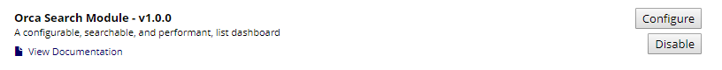
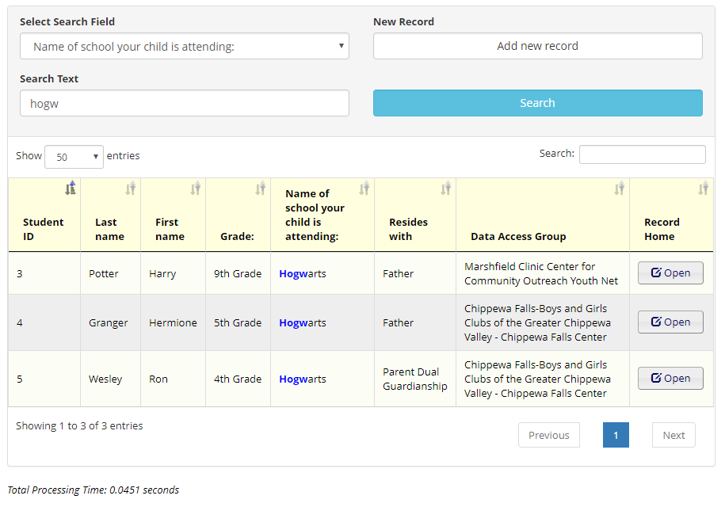
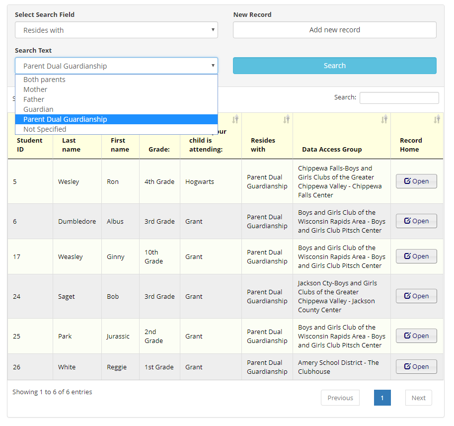

# Orca Search (REDCap External Module)

A configurable, searchable, and performant, list dashboard.

### Purpose

To enhance searching REDCap records.  This module can also be used to create a custom list dashboard.

### Disclaimer

This module does not yet support repeating events.

## Features

- Configurable field search options
- Configurable field display options
- New Record support for projects with and without auto-numbering enabled
- Result highlighting when searching with partial matching enabled
- Support for searching through repeating forms
- Data Access Group security
  - Users in a DAG will only see results from within their DAG
  - Users not assigned a DAG will see results regardless of DAG

## Testing & Validation

- REDCap
  - 8.2.2
  - 8.3.2
  - 8.4.5
  - 8.5.0
  - 8.6.0
- PHP
  - This module has been tested against all major versions of PHP that are supported by REDCap >= 8.0.0

## Permissions

- redcap_every_page_top

## Configuration

- Enable the module in your project, if it is not already enabled
- Click **Configure** for **Orca Search Module**

## Options

- **Redirect Add/Edit Records to Module**
  - Check this option if you would like to "replace" the Add/Edit Records page with this module.
  - When a user clicks the link, they will be directed to the module's search page. 
- **Limit the search results**
  - The results can be restricted to 500, 1000, 2000, 5000, or No Limit.  If the search results exceed that number, an error message will display and no results will show.
- **Which instances to search through**
  - **Latest** - search only the most recent instances of forms.
  - **All** - all instances will be considered.
  - *Currently, the results table will always display the result from the latest instance, even if the matching value was found on a previous instance.* 
- **Show instance badge**
  - A red badge will display in the data table, indicating which instance the displayed value was found.
- **Include DAG in results**
  - An additional column will display in the results, indicating the Data Access Group that record belongs to.
  - This option only works if the project uses Data Access Groups.
- **Search Fields**
  - This repeating configuration allows you to select the fields that you want to use as search fields.
  - Fields will display in the dropdown, in the order that exist in the config.
  - Fields that are select, radio, form status, etc., will display a dropdown instead of a text box, for filtering by value.
  - **Return Partial Matches**
    - This option allows you to do a 'wildcard' search on that field (i.e. searching **wis** in a state search will return results for **Wis**consin)
    - **NOTE:** This option is ignored if the field type is **radio**, **select**, or **checkbox**
- **Display Fields**
  - These are the fields you wish to see in the results table
  - Text values will display as-is, while structured data will show the display values.
  - Selecting the *form_name_complete* fields will display accordingly (Incomplete, Unverified, Complete).
  - Fields will display in the table, in the order they are selected in the config.

### Searching a text field using a partial match

### Searching a dropdown field

## Considerations

- DateTime fields are displayed and searched using the values as they are stored in the database (YYYY-MM-DD).
- If a project uses Data Access Groups, and the record_id field is displayed, I've done my best to ensure that column sorts as expected.
- For projects with significant record counts (10,000+, especially if they use DAGs), the usage of getAutoId() for adding new records will increase the load times of the module.
  - For a baseline example, a project with ~45k records takes 4-8 seconds for getAutoId() to complete.
- If you identify any issues, please submit an issue on this GitHub repo or make a post on the forums and tag me (@chris.kadolph)

## Future Support

- Multiple Filters
- Use DateTime format from the Data Dictionary rather than raw database value 
- Support for displaying the latest instance that matched the search criteria
- Custom configuration page
- Row formatting (i.e. form status indicators)