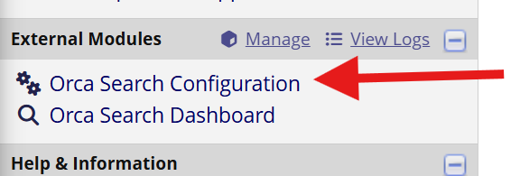
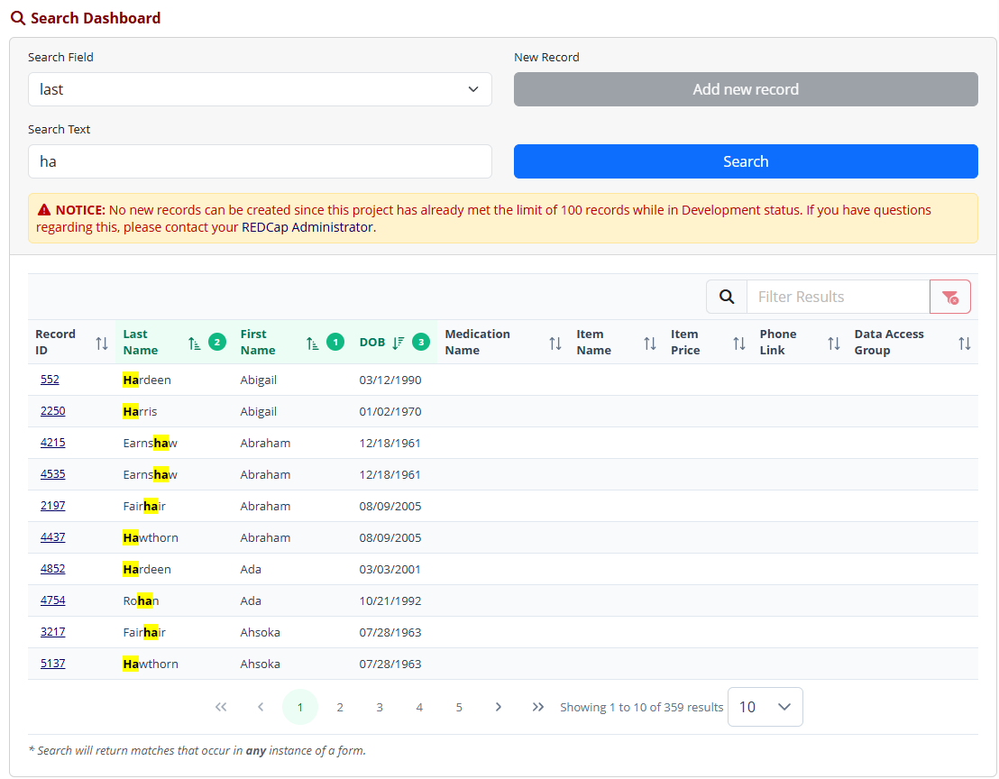
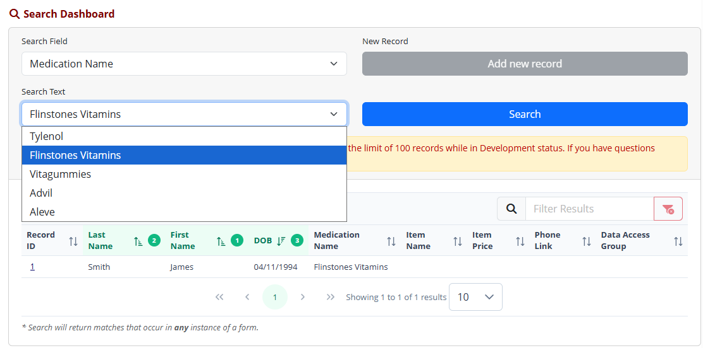

# Orca Search (REDCap External Module)

A configurable, searchable, and performant, list dashboard.

### Purpose

To enhance searching REDCap records.  This module can also be used to create a custom list dashboard.

### Disclaimer

This module does not yet support repeating events.

## Features

- Configurable field search options
- Configurable field display options
- New Record support for projects with and without auto-numbering enabled
- Result highlighting when searching with partial matching enabled
- Support for searching through repeating forms
- Data Access Group security
  - Users in a DAG will only see results from within their DAG
  - Users not assigned a DAG will see results regardless of DAG
- Enforcement of User Rights
  - Ensures users only see fields on forms they have access to
- Development Record Limit is enforced for adding new records
  - This will use the value provided in the Control Center, unless further restricted in the Project-level config
- Long text truncation
  - To prevent dropdowns from extending off screen and table headers causing significant visual issues, field labels, structured data values (select, radio, checkbox), and Dynamic SQL results will be truncated down to 60 characters **OR** the first new line, whichever one comes first.
  - If truncation causes visual text to be removed, an ellipsis (...) will be appended to the end.
  - **NOTE:** An ellipsis only applies to multi-line labels if the first line exceeds 60 characters.

## Testing & Validation

- REDCap
  - Minimum: 14.0.2 STD (framework v15)
  - Latest: 17.1.2 STD
- PHP
  - This module has been tested against all major versions of PHP that are supported by REDCap, up to PHP v8.3.x

## Permissions

- redcap_every_page_top

## Configuration

- Enable the module in your project, if it is not already enabled
- Click the custom configuration link in the **External Modules** section of the Project sidebar

## Options

### General Configuration

- **Redirect Add/Edit Records to Module**
  - Check this option if you would like to "replace" the Add/Edit Records page with this module.
  - When a user clicks the link, they will be directed to the module's search page. 
- **Enable DAG Display**
  - An additional column will display in the results, indicating the Data Access Group that record belongs to.
  - This option only works if the project uses Data Access Groups.
- **Disable Empty Search**
  - Forces users to always provide a value when searching.  This can be useful when you want to restrict access to records (i.e. MRN exact match).
- **Search Limit**
  - The results can be restricted to 500, 1000, 2000, 5000, or No Limit.  If the search results exceed that number, an error message will display and no results will show.
- **Repeat Instance Search Method**
  - **Latest** - search only the most recent instances of forms.
  - **All** - all instances will be considered.
  - *Currently, the results table will always display the result from the latest instance, even if the matching value was found on a previous instance.*
- **Record Home Display**
  - Where to position Record Home button in the display fields table (default=Last Column, use None to hide it).
- **Enable Data Context Display**
  - When enabled, the search results will display event/instance context for each piece of data using smaller muted text

### Search Fields

- This repeating configuration allows you to select the fields that you want to use as search fields.
- The filter box at the top of the dialog allows you to search for anything displayed, like field name, field label, and instrument 
- Fields will display in the dropdown, in the order that exist in the config.
  - You can drag-n-drop the fields using the icon in the far left column of the table, if you would like to customize the order
- Fields that are select, radio, form status, etc., will display a dropdown instead of a text box, for filtering by value.
- Custom Label
  - The text displayed for this search field can use custom text instead of the field label
- **Partial Matches?**
  - This option allows you to do a 'wildcard' search on that field (i.e. searching **deer** instead of "Leila **Deer**ing")
  - **NOTE:** This option is disabled if the field type is **radio**, **select**, **checkbox**, or **sql**

### Display Fields

- These are the fields you wish to see in the results table
- Text values will display as-is, while structured data will show the display values.
- Selecting the *form_name_complete* fields will display accordingly (Incomplete, Unverified, Complete).
- Fields will display in the table, in the order they are selected in the config.
  - You can drag-n-drop the fields using the icon in the far left column of the table, if you would like to customize the order
- Custom Header
  - The column header for this display field can use custom text instead of the field label
- Sorting
  - You can enable a default sort on the table by enabling it for one or more display fields, specifying a sort direction and priority for each

### Searching a text field using a partial match

### Searching a dropdown field

## Considerations

- DateTime fields are displayed and searched using the values as they are stored in the database (YYYY-MM-DD).
- If a project uses Data Access Groups, and the record_id field is displayed, I've done my best to ensure that column sorts as expected.
- For projects with significant record counts (10,000+, especially if they use DAGs), the usage of getAutoId() for adding new records will increase the load times of the module.
  - For a baseline example, a project with ~45k records takes 4-8 seconds for getAutoId() to complete.
- If you identify any issues, please submit an issue on this GitHub repo or make a post on the forums and tag me (@chris.kadolph)